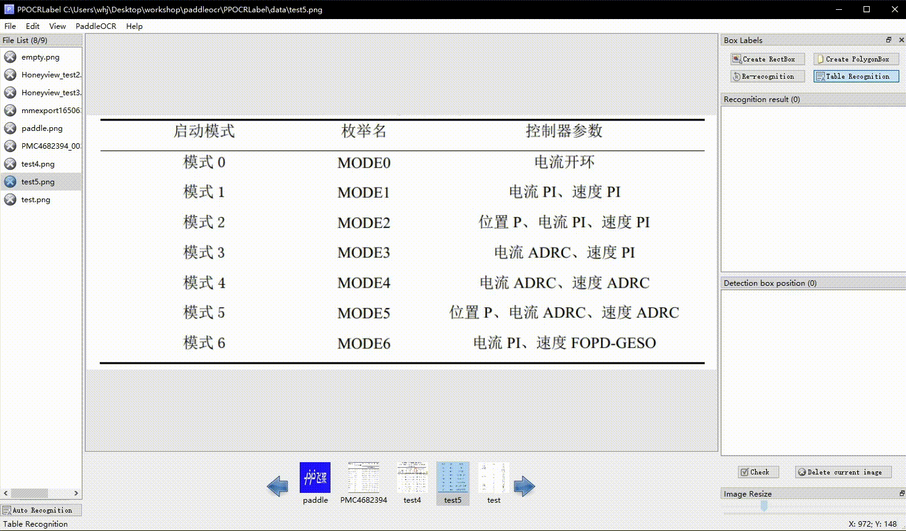

# EasyOCRLabel

EasyOCRLabel is a semi-automatic graphic annotation tool suitable for OCR field, with built-in EasyOCR model to automatically detect and re-recognize data. It is written in Python3 and PyQT5, supporting rectangular box, table, irregular text and key information annotation modes. Annotations can be directly used for the training of EasyOCR detection and recognition models.

|                 regular text annotation                 |                  table annotation                  |
| :-----------------------------------------------------: | :------------------------------------------------: |
|    |  |
|           **irregular text annotation**           |        **key information annotation**        |
|  |    |

## 1. Installation and Run

### 1.1 Install EasyOCR

   Install using `pip`

For the latest stable release:

```bash
pip install easyocr
```

For the latest development release:

```bash
pip install git+https://github.com/JaidedAI/EasyOCR.git
```

Note 1: For Windows, please install torch and torchvision first by following the official instructions here https://pytorch.org. On the pytorch website, be sure to select the right CUDA version you have. If you intend to run on CPU mode only, select `CUDA = None`.

#### 1.2.2 Run EasyOCRLabel by Python Script

If you modify the EasyOCRLabel file (for example, specifying a new built-in model), it will be more convenient to see the results by running the Python script. If you still want to start with the whl package, you need to uninstall the whl package in the current environment and then recompile it according to the next section.

```bash
cd ./EasyOCRLabel  # Switch to the EasyOCRLabel directory
# Select label mode and run 
python PPOCRLabel.py  # [Normal mode] for [detection + recognition] labeling
python PPOCRLabel.py --kie True # [KIE mode] for [detection + recognition + keyword extraction] labeling
```

## 2. Usage

### 2.1 Steps

1. Build and launch using the instructions above.
2. Click 'Open Dir' in Menu/File to select the folder of the picture.[1]
3. Click 'Auto recognition', use EasyOCR model to automatically annotate images which marked with 'X'  [2]before the file name.
4. Create Box:

   4.1 Click 'Create RectBox' or press 'W' in English keyboard mode to draw a new rectangle detection box. Click and release left mouse to select a region to annotate the text area.

   4.2 Press 'Q' to enter four-point labeling mode which enables you to create any four-point shape by clicking four points with the left mouse button in succession and DOUBLE CLICK the left mouse as the signal of labeling completion.
5. After the marking frame is drawn, the user clicks "OK", and the detection frame will be pre-assigned a "TEMPORARY" label.
6. Click 're-Recognition', model will rewrite ALL recognition results in ALL detection box[3].
7. Single click the result in 'recognition result' list to manually change inaccurate recognition results.
8. **Click "Check", the image status will switch to "√",then the program automatically jump to the next.**
9. Click "Delete Image", and the image will be deleted to the recycle bin.
10. Labeling result: the user can export the label result manually through the menu "File - Export Label", while the program will also export automatically if "File - Auto export Label Mode" is selected. The manually checked label will be stored in  _Label.txt_  under the opened picture folder. Click "File"-"Export Recognition Results" in the menu bar, the recognition training data of such pictures will be saved in the  _crop_img_  folder, and the recognition label will be saved in  _rec_gt.txt_[4].

### 2.2 Table Annotation

The table annotation is aimed at extracting the structure of the table in a picture and converting it to Excel format, so the annotation needs to be done simultaneously with external software to edit Excel. In EasyOCRLabel, complete the text information labeling (text and position), complete the table structure information labeling in the Excel file, the recommended steps are:

1. Table annotation: After opening the table picture, click on the  `Table Recognition`  button in the upper right corner of EasyOCRLabel, which will call the table recognition model in PP-Structure to automatically label the table and pop up Excel at the same time.
2. Change the recognition result:  **label each cell**  (i.e. the text in a cell is marked as a box). Right click on the box and click on  `Cell Re-recognition`. You can use the model to automatically recognise the text within a cell.
3. Mark the table structure: for each cell contains the text,  **mark as any identifier (such as  `1`) in Excel**, to ensure that the merged cell structure is same as the original picture.
4. Export JSON format annotation: close all Excel files corresponding to table images, click  `File`-`Export table JSON annotation`  to obtain JSON annotation results.

### 2.3 Note

[1] EasyOCRLabel uses the opened folder as the project. After opening the image folder, the picture will not be displayed in the dialog. Instead, the pictures under the folder will be directly imported into the program after clicking "Open Dir".

[2] The image status indicates whether the user has saved the image manually. If it has not been saved manually it is "X", otherwise it is "√", EasyOCRLabel will not relabel pictures with a status of "√".

[3] After clicking "Re-recognize", the model will overwrite ALL recognition results in the picture. Therefore, if the recognition result has been manually changed before, it may change after re-recognition.

[4] The files produced by EasyOCRLabel can be found under the opened picture folder including the following, please do not manually change the contents, otherwise it will cause the program to be abnormal.

|   File name   |                                                                                                                        Description                                                                                                                        |
| :-----------: | :--------------------------------------------------------------------------------------------------------------------------------------------------------------------------------------------------------------------------------------------------------: |
|   Label.txt   | The detection label file can be directly used for PP-OCR detection model training. After the user saves 5 label results, the file will be automatically exported. It will also be written when the user closes the application or changes the file folder. |
| fileState.txt |                                                                         The picture status file save the image in the current folder that has been manually confirmed by the user.                                                                         |
|  Cache.cach  |                                                                                                   Cache files to save the results of model recognition.                                                                                                   |
|  rec_gt.txt  |                                  The recognition label file, which can be directly used for PP-OCR identification model training, is generated after the user clicks on the menu bar "File"-"Export recognition result".                                  |
|   crop_img   |                                                                                            The recognition data, generated at the same time with*rec_gt.txt*                                                                                            |

## 3. Explanation

### 3.1 Shortcut keys

| Shortcut keys            | Description                                       |
| ------------------------ | ------------------------------------------------- |
| Ctrl + Shift + R         | Re-recognize all the labels of the current image  |
| W                        | Create a rect box                                 |
| Q                        | Create a multi-points box                         |
| X                        | Rotate the box anti-clockwise                     |
| C                        | Rotate the box clockwise                          |
| Ctrl + E                 | Edit label of the selected box                    |
| Ctrl + X                 | Change key class of the box when enable `--kie` |
| Ctrl + R                 | Re-recognize the selected box                     |
| Ctrl + C                 | Copy and paste the selected box                   |
| Ctrl + Left Mouse Button | Multi select the label box                        |
| Backspace                | Delete the selected box                           |
| Ctrl + V                 | Check image                                       |
| Ctrl + Shift + d         | Delete image                                      |
| D                        | Next image                                        |
| A                        | Previous image                                    |
| Ctrl++                   | Zoom in                                           |
| Ctrl--                   | Zoom out                                          |
| ↑→↓←                 | Move selected box                                 |

### 3.2 Built-in Model

- Default model: EasyOCRLabel uses the Chinese and English ultra-lightweight OCR model in EasyOCRLabel by default, supports Chinese, English and number recognition, and multiple language detection.
- Model language switching: Changing the built-in model language is supportable by clicking "EasyOCR"-"Choose OCR Model" in the menu bar. Currently supported languagesinclude French, German, Korean, and Japanese.
  For specific model download links, please refer to [EasyOCR Model List](https://www.jaided.ai/easyocr/modelhub/)
- **Custom Model**: If users want to replace the built-in model with their own inference model, they can follow the [Custom Model Code Usage](https://github.com/JaidedAI/EasyOCR/blob/master/custom_model.md)

### 3.3 Export Label Result

EasyOCRLabel supports three ways to export Label.txt

- Automatically export: After selecting "File - Auto Export Label Mode", the program will automatically write the annotations into Label.txt every time the user confirms an image. If this option is not turned on, it will be automatically exported after detecting that the user has manually checked 5 images.

  > The automatically export mode is turned off by default
  >
- Manual export: Click "File-Export Marking Results" to manually export the label.
- Close application export

### 3.4 Export Partial Recognition Results

For some data that are difficult to recognize, the recognition results will not be exported by **unchecking** the corresponding tags in the recognition results checkbox. The unchecked recognition result is saved as `True` in the `difficult` variable in the label file `label.txt`.

> *Note: The status of the checkboxes in the recognition results still needs to be saved manually by clicking Save Button.*

### 3.5 Dataset division

- Enter the following command in the terminal to execute the dataset division script:

  ```
  cd ./PPOCRLabel # Change the directory to the PPOCRLabel folder
  python gen_ocr_train_val_test.py --trainValTestRatio 6:2:2 --datasetRootPath ../train_data 
  ```

  Parameter Description:

  - `trainValTestRatio` is the division ratio of the number of images in the training set, validation set, and test set, set according to your actual situation, the default is `6:2:2`
  - `datasetRootPath` is the storage path of the complete dataset labeled by PPOCRLabel. The default path is `PaddleOCR/train_data` .

  ```
  |-train_data
    |-crop_img
      |- word_001_crop_0.png
      |- word_002_crop_0.jpg
      |- word_003_crop_0.jpg
      | ...
    | Label.txt
    | rec_gt.txt
    |- word_001.png
    |- word_002.jpg
    |- word_003.jpg
    | ...
  ```

### 4. Related

1. [Tzutalin. LabelImg. Git code (2015)](https://github.com/tzutalin/labelImg)
2. [Evezerest. PPOCRLabel. Git code (2022)](https://github.com/Evezerest/PPOCRLabel)
